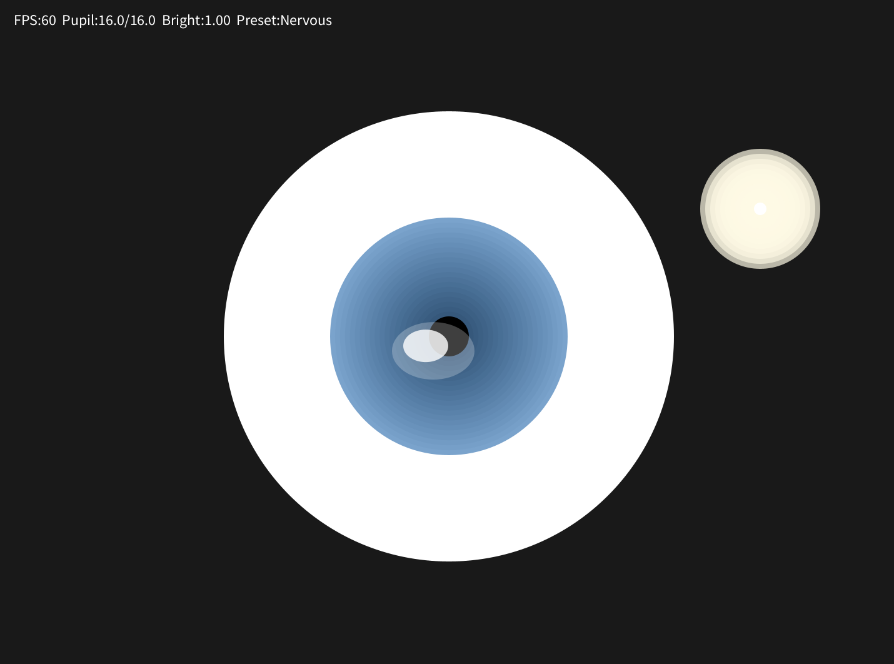
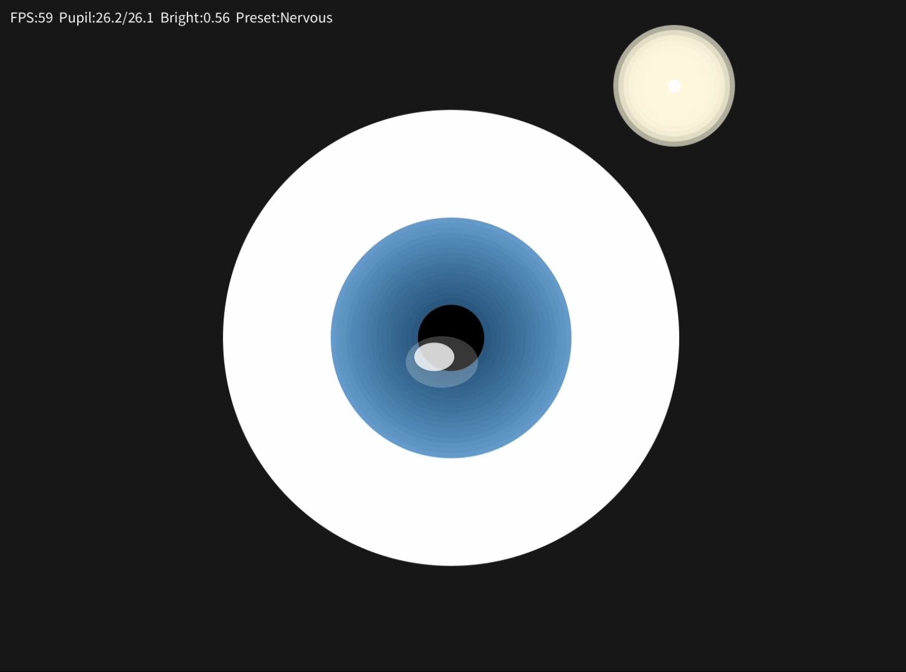
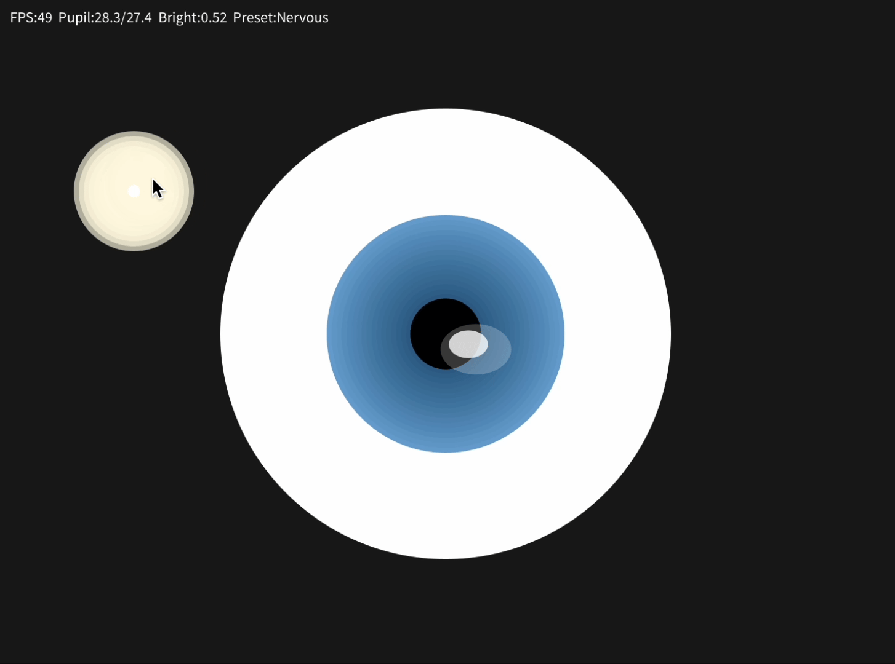

# Blink: A Pupil Animation

This is a small interactive project that was built with Processing (Python Mode).
It shows how pupils get bigger and smaller based on light and emotions.
The aim is to show how code can turn invisible psychological reactions into digital art.

##  Table of Contents
- General Info  
- Technologies Used  
- Features  
- Screenshots  
- Setup  
- Usage  
- Project Status  
- Room for Improvement  
- Acknowledgements  
- Contact  

---

## General Info
This project explores how subtle human emotions can be expressed through **pupil movement**.  
It solves the problem of making invisible body reactions (like pupil dilation) visible to an audience.  
The purpose is to combine design and programming into an expressive, minimal animation.  
I undertook this project as part of my coursework to practice code literacy and creative coding.  

---

## Technologies Used
- Processing (Python Mode) – version 3.x  
- Built-in Processing functions (`map()`, `noise()`, `lerpColor()`)  
- Laptop only (no extra hardware needed)  

---

## ✨ Features
- Real-time pupil animation  
- Emotional presets:  
  - **1 = Calm**  
  - **2 = Focused**  
  - **3 = Nervous**  
- Interactive light source:  
  - **Drag mouse** to move light  
  - **A / D keys** to adjust intensity  
- Debug info overlay (**G**) → shows FPS, pupil size, current preset  
- Toggle light visualization (**L**) → shows or hides the light source  

---

## Screenshots

Here is the pupil animation demo:

  
---

## Setup
Requirements:  
- Processing installed from [processing.org](https://processing.org/download)  
- Switch Processing to **Python Mode**  

Steps:  
1. Clone or download this repo.  
2. Open `Pupil.pyde` in Processing.  
3. Run the sketch.  

---

## Usage
| Key/Action | Function |  
|------------|-----------|  
| `1` | Calm preset |  
| `2` | Focused preset |  
| `3` | Nervous preset |  
| `A` | Decrease light intensity |  
| `D` | Increase light intensity |  
| `G` | Toggle debug info |  
| `L` | Toggle light display |  
| Drag Mouse | Move light source |  

---

## Project Status
Project is: **Complete** ✅  
The prototype works as intended and demonstrates code literacy.  

---

## Room for Improvement
- Add eyelid blinking for realism  
- More emotional states (happy, sad, etc.)  
- Export to standalone app or interactive website  

---

## Acknowledgements
This project was inspired by:  
- Daniel Shiffman’s *The Nature of Code* and [The Coding Train](https://www.youtube.com/c/TheCodingTrain)  
- Processing Foundation – [processing.org](https://processing.org)  
- OpenProcessing community sketches  

---

## Contact
Created by **Zhijia He** (Student ID: 14563249, Tutorial T10)  
Feel free to connect if you have feedback!  

